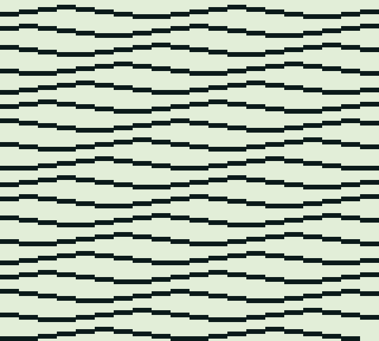
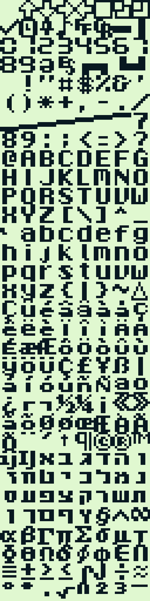

## Cinquain Wave

Cinquain Wave is a [GB BASIC](https://paladin-t.github.io/kits/gbb/) program runs on Game Boy, which generates animated waves endlessly.

This is a re-creation of the [C64 one-liner, wave "animation"](https://www.youtube.com/watch?v=0yKwJJw6Abs)


*"This just repeatedly prints characters and as such is much less sophisticated than 10 PRINT CHR$(205.5+RND(1)); : GOTO 10 ...but I think this is a bit more 'animated'."*

### Running

Put "Cinquain Wave.gb" on any Game Boy device, and launch it. Or try in [browser](https://paladin-t.github.io/cinquain-wave.gbb/index.html).



### Source Code

Open "Cinquain Wave.gbb" with the [latest GB BASIC](https://store.steampowered.com/app/2308700/), the only code lines as follows:

```vb
1 option SCREEN_MODE, TEXT_MODE
2 fill tile(0, 256) = "Text"
10 print "012343210";
20 wait 3
30 goto 10
```

This program uses a modified font so that "01234..." are replaced with line glyphs for the effect:



This is free and unencumbered software released into the public domain. See [`LICENSE`](LICENSE).
